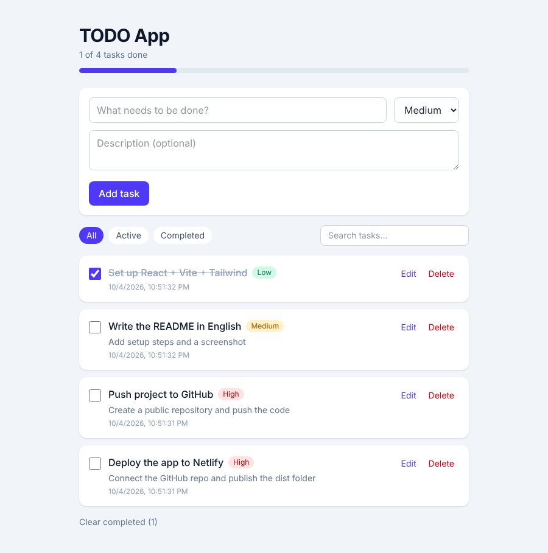

# TODO App

A TODO list application built with **React**, **Vite**, **TypeScript** and **Tailwind CSS**.
It was made for the *Web Development* training project and covers the four basic CRUD operations.
Data is saved in the browser's **LocalStorage**, so tasks stay after a page refresh.

**Live demo:** https://vermillion-taffy-969ee9.netlify.app



## Features

| Operation | How it works in the app |
|-----------|-------------------------|
| **Add** (Create) | Type a title, optional description and priority, then press **Add task** |
| **List** (Read) | All tasks are listed, with **All / Active / Completed** filters and search |
| **Update** | Click **Edit** to change a task inline, or tick the checkbox to mark it done |
| **Delete** | Click **Delete** (with confirmation), or **Clear completed** |

Other details: progress bar, priority badges, form validation, and a responsive layout for phone and desktop.

## Tech stack

- [React 19](https://react.dev/) – UI library
- [Vite](https://vite.dev/) – development server and build tool
- [TypeScript](https://www.typescriptlang.org/) – type safety (types live in `src/interfaces`)
- [Tailwind CSS 4](https://tailwindcss.com/) – styling
- LocalStorage – data persistence
- [Netlify](https://www.netlify.com/) – hosting

## Project structure

```
todo-app/
├── docs/screenshot.png
├── public/
├── src/
│   ├── components/        # Reusable UI pieces
│   │   ├── FilterBar.tsx
│   │   ├── Header.tsx
│   │   ├── TodoForm.tsx   # Add
│   │   ├── TodoItem.tsx   # Update + Delete
│   │   └── TodoList.tsx   # List
│   ├── hooks/
│   │   └── useTodos.ts    # All CRUD logic + LocalStorage
│   ├── interfaces/
│   │   └── Todo.ts        # TypeScript types
│   ├── pages/
│   │   └── HomePage.tsx
│   ├── App.tsx
│   ├── index.css          # Tailwind import
│   └── main.tsx
├── netlify.toml           # Netlify build settings
├── index.html
├── package.json
└── vite.config.ts
```

## Getting started

Requirements: [Node.js](https://nodejs.org/) 20.19+ (or 22.12+).

```bash
# 1. Install dependencies
npm install

# 2. Start the development server (http://localhost:5173)
npm run dev

# 3. Build for production (output in /dist)
npm run build

# 4. Preview the production build
npm run preview
```

## Deployment

The project is deployed on Netlify. Settings (already in `netlify.toml`):

- Build command: `npm run build`
- Publish directory: `dist`
